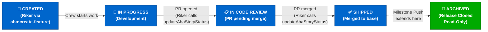
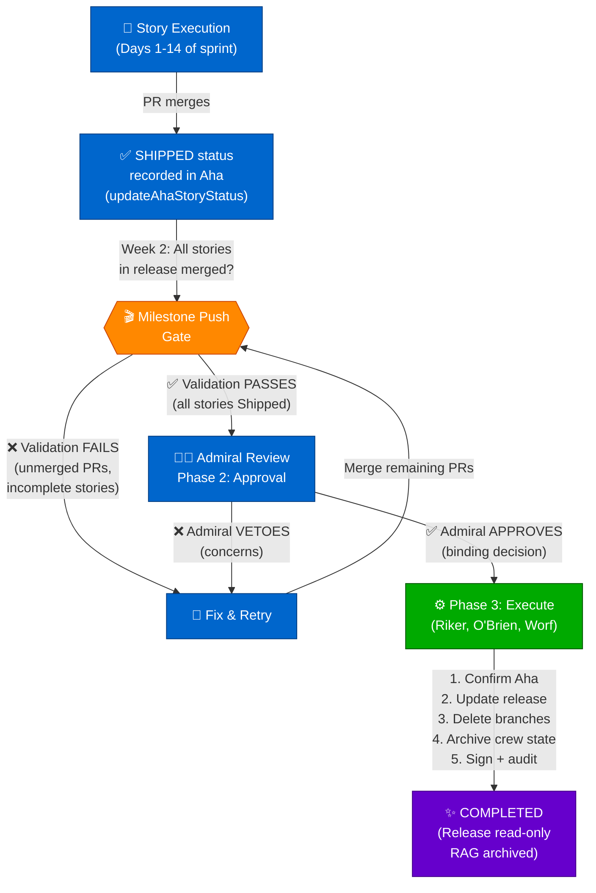
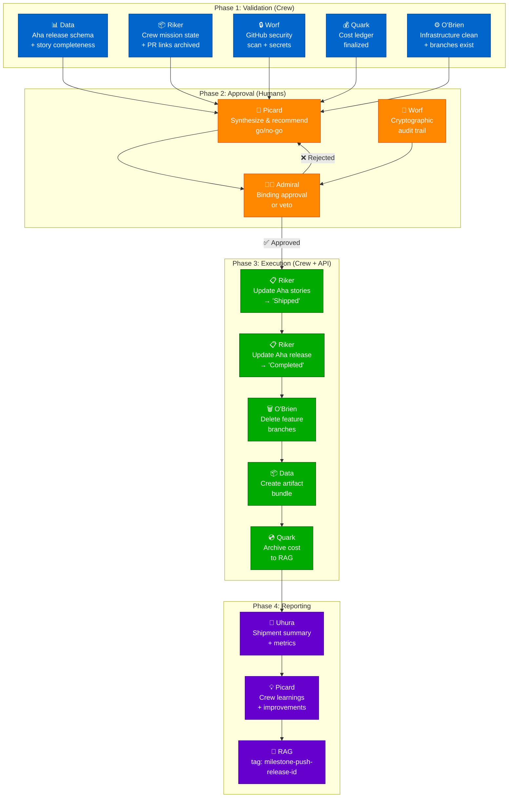
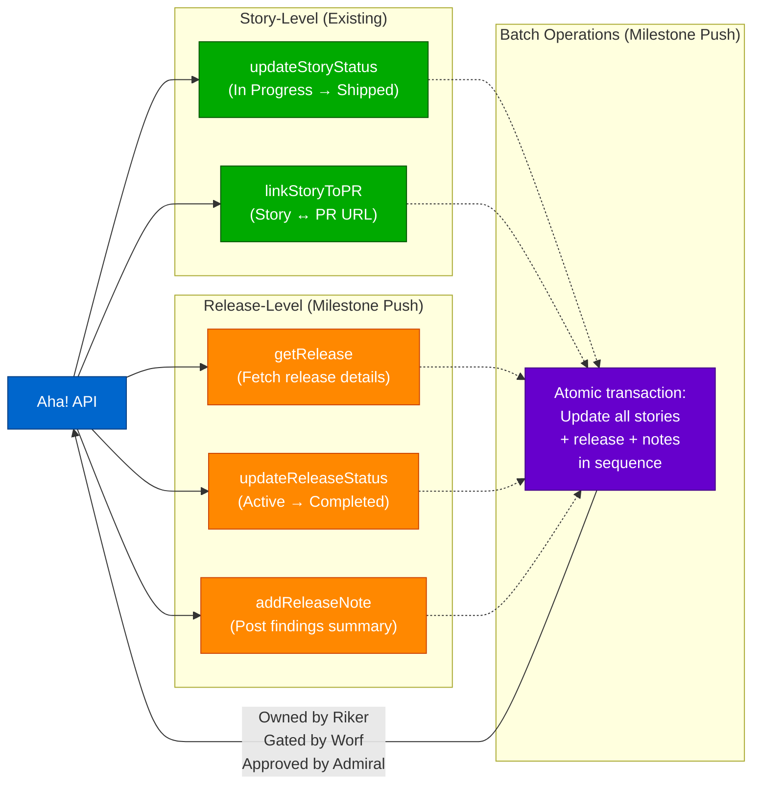
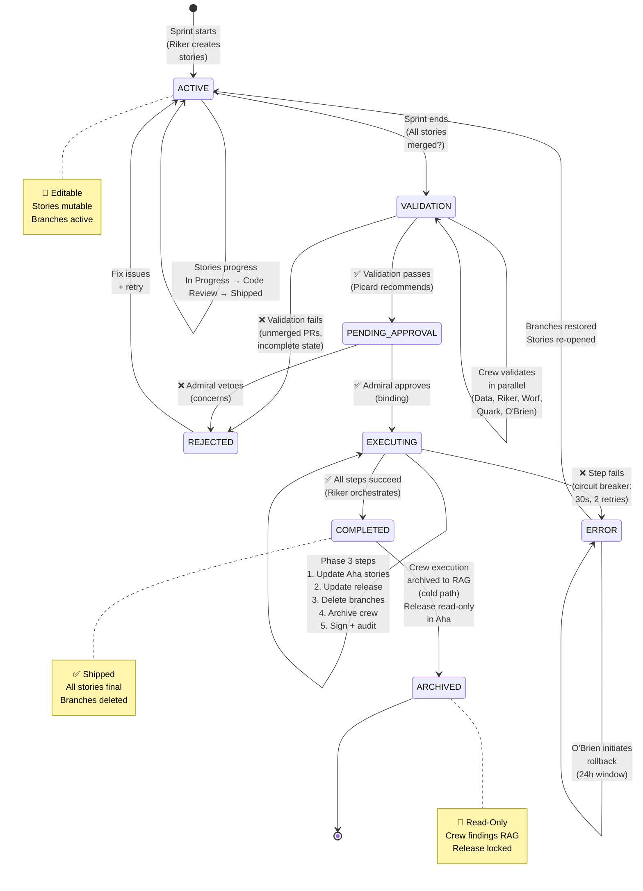
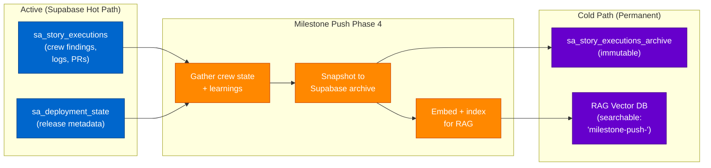

# Milestone Push & Aha Integration Diagram

## Current Story Lifecycle

## Story Lifecycle with Milestone Push

## Aha Integration Points

## Aha API Integration

## Release State Machine

## Data Flow: Crew Execution State → Archive → RAG

## 4 Pre-Implementation Clarifications

| Clarification | Current State | Proposed | Owner |
|---|---|---|---|
| **Story Semantics** | Story marked "Shipped" when PR merges | 3-tier: Complete (PR merged) → Shipped (milestone) → Archived (read-only) | Riker |
| **Release State** | No explicit release closure | Milestone push marks release "Completed" (read-only) | Geordi |
| **Approval Tiers** | WorfGate only (story-level) | WorfGate (story) + Admiral (release) separate gates | Worf + Picard |
| **Aha Automation** | Unknown (audit needed) | Create `docs/aha-workflow-rules.md`; audit before each push | Data |

## Integration Checklist

- [ ] Clarification 1: 3-tier story completion model implemented (Riker)
- [ ] Clarification 2: Release state model (read-only after "Completed") documented (Geordi)
- [ ] Clarification 3: Approval tiers (WorfGate + Admiral) defined in milestone_push tool (Worf)
- [ ] Clarification 4: Aha automation audit completed; no conflicting rules (Data)
- [ ] Implementation: Phase 1 crew assignments (Data schemas, O'Brien GitHub Actions, etc.)
- [ ] Testing: Milestone push tested in dev environment with full workflow
- [ ] Documentation: Release notes + crew briefing on new workflow
- [ ] Validation: First production milestone push with Admiral oversight

---

## Key Integration Decisions

1. **No New Aha APIs**: Milestone push reuses existing `updateStoryStatus`, `updateRelease`, etc. Riker orchestrates existing endpoints in sequence.

2. **Loose Coupling**: Milestone push doesn't interfere with day-to-day story execution. It's a release-level ceremony that reads final states and archives them.

3. **Dual Approval Gates**: Story writes go through WorfGate (crew governance). Release closure requires Admiral approval (business authority). Both gates apply independently.

4. **Idempotent Execution**: Milestone push can retry safely. If Aha updates but GitHub branch deletion fails, rollback available within 24h.

5. **Cold Path Archive**: Crew execution state moves from hot (active) to cold (archive) on milestone completion. RAG enables historical search and learning recall.

---

**Document Status**: ✅ CREW-APPROVED INTEGRATION DESIGN  
**RAG Tag**: `milestone-push-aha-integration-v1`  
**Next**: Admiral review + Phase 1 authorization

