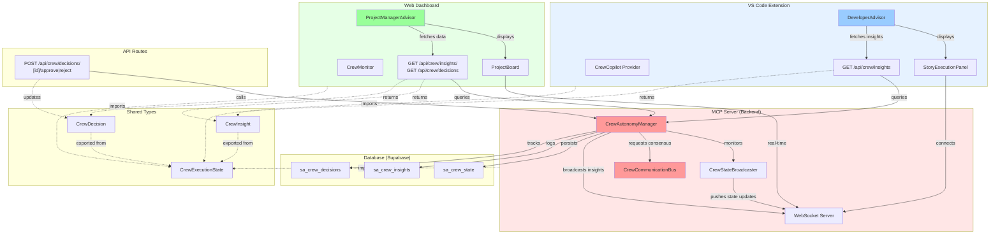
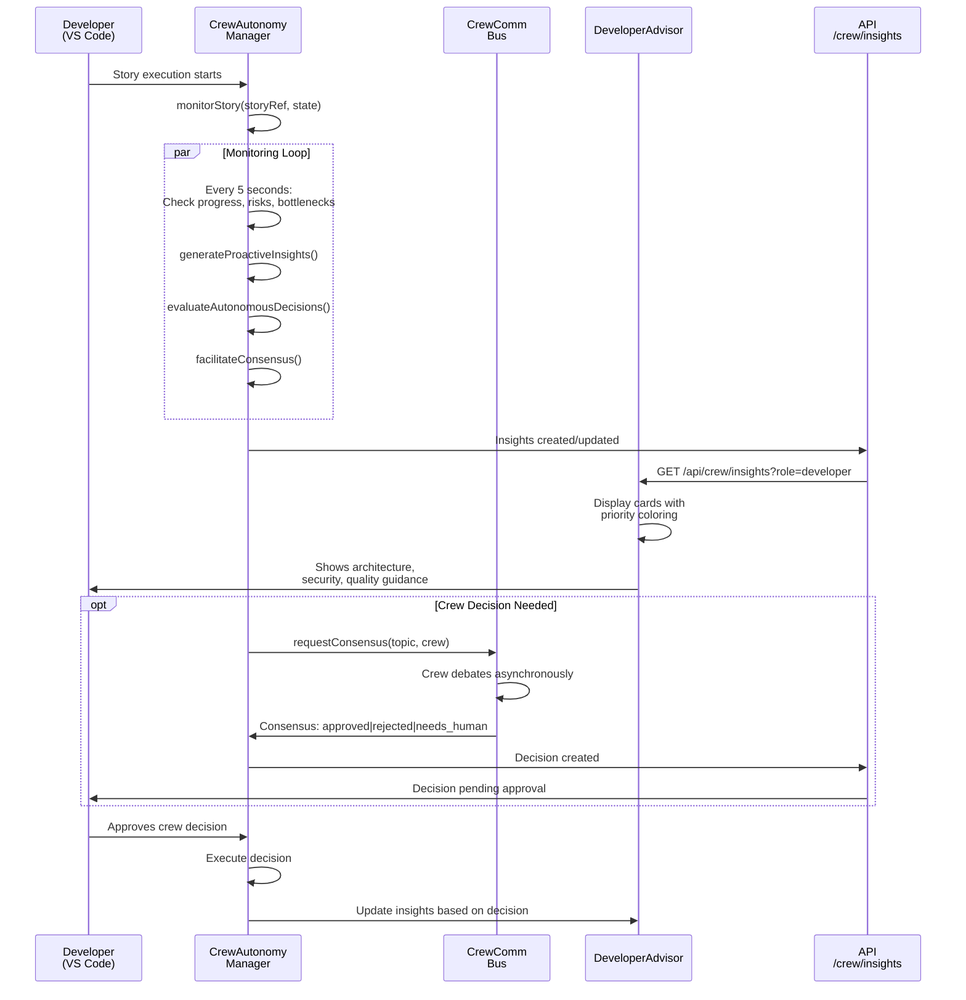
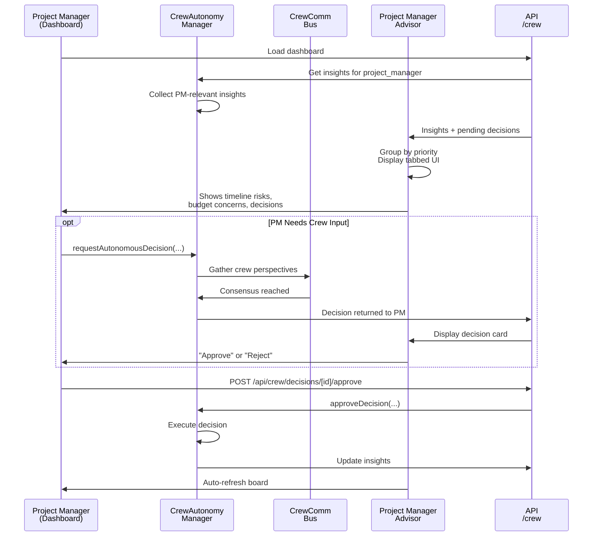
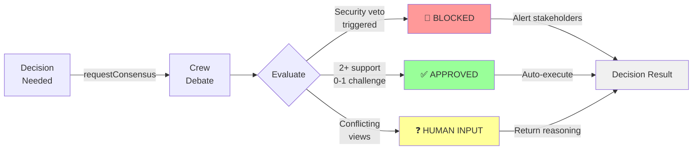
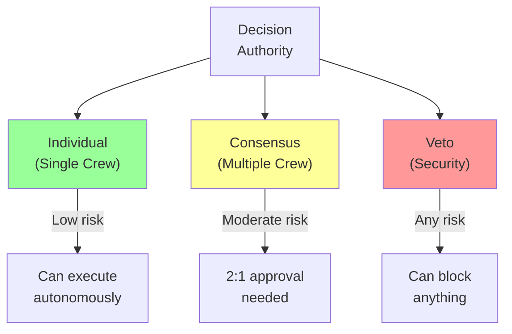
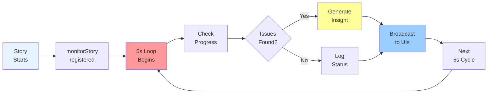

# Autonomous Crew System - Architecture Diagram

## Data Flow: Story Execution to Insights

## Project Manager View

## Crew Consensus Mechanism

## Authority Hierarchy

## Real-Time Monitoring Loop

