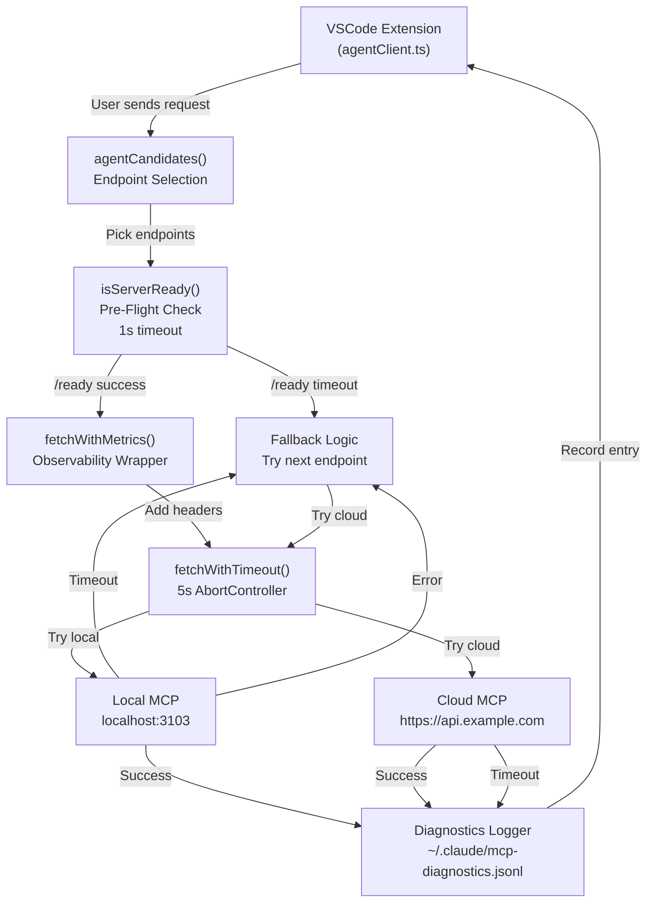

# Phase 7: Architecture Deep Dive

## Overview

Phase 7 modernizes the MCP integration by introducing timeout mechanisms, observability, and graceful fallback behavior. This guide explains how each component fits together and why the design choices were made.

## MCP Server Architecture

The MCP server runs as a Node.js process listening on `http://localhost:3103` (or cloud endpoint `https://api.example.com` in production).

### HTTP Endpoints

#### `GET /ready` — Pre-Flight Health Check

**Purpose:** Allow clients to verify MCP server is alive before sending expensive requests

**Request:**
```http
GET /ready HTTP/1.1
Host: localhost:3103
X-Request-ID: uuid-here
```

**Response (200 OK):**
```json
{
  "ready": true,
  "server": "local",
  "uptime_ms": 12345,
  "timestamp": "2026-08-30T17:45:00.000Z",
  "version": "7.0.0"
}
```

**Response (503 Service Unavailable):**
```json
{
  "ready": false,
  "error": "MCP server starting up..."
}
```

**Timeout Behavior:**
- VSCode extension pre-flight timeout: **1000ms** (aggressive)
- If `/ready` times out, server is marked unavailable
- Extension falls back to next candidate endpoint

### `POST /agent` — Main Agent Endpoint

**Purpose:** Accept agent requests and return crew deliberation results

**Request:**
```json
{
  "input": "natural language query",
  "storyId": "STORY-123",
  "crewId": "picard",
  "model": "openrouter/deepseek-chat"
}
```

**Response (200 OK):**
```json
{
  "result": "crew response",
  "server": "local",
  "latency_ms": 42,
  "crew_member": "Data"
}
```

**Request Timeout Behavior:**
- VSCode extension request timeout: **5000ms** (generous for crew deliberation)
- If request times out, extension falls back to next endpoint (cloud)
- If all endpoints timeout, user sees "MCP unavailable" error with recovery steps

## VSCode Extension Architecture

The VSCode extension (packages/vscode-extension/) is responsible for:
1. Determining which endpoint to use (local vs cloud)
2. Sending requests with observability headers
3. Handling timeouts and fallback behavior
4. Logging diagnostics for debugging

### Core Components

#### `agentClient.ts` — Request Handler

**Key Functions:**

```typescript
export async function fetchWithTimeout(
  url: string,
  options: RequestInit,
  timeoutMs: number = 5000
): Promise<Response>
```

**Behavior:**
- Uses AbortController to cancel requests after `timeoutMs`
- Throws AbortError on timeout (caught by caller for fallback)
- Returns Response on success

**Example Usage:**
```typescript
try {
  const response = await fetchWithTimeout(
    'http://localhost:3103/agent',
    { method: 'POST', body: JSON.stringify(payload) },
    5000
  );
  return await response.json();
} catch (error) {
  if (error.name === 'AbortError') {
    // Timeout — try next endpoint
    return fetchWithTimeout(cloudURL, options, 5000);
  }
  throw error;
}
```

#### `agentCandidates()` — Endpoint Selection

**Purpose:** Determine which endpoints to try, in order

**Algorithm:**
```typescript
function agentCandidates(): string[] {
  const preferLocal = process.env.STORY_AGENT_PREFER_LOCAL === 'true';
  
  const local = 'http://localhost:3103/agent';
  const cloud = 'https://api.example.com/agent';
  
  return preferLocal ? [local, cloud] : [cloud, local];
}
```

**Defaults:**
- `STORY_AGENT_PREFER_LOCAL` unset → cloud-first (production mode)
- `STORY_AGENT_PREFER_LOCAL=true` → local-first (development mode)
- `STORY_AGENT_PREFER_LOCAL=false` → cloud-first (explicit production)

#### `fetchWithMetrics()` — Observability Wrapper

**Purpose:** Wrap `fetchWithTimeout()` with observability headers and latency measurement

**Behavior:**
1. Records start time
2. Adds `X-MCP-Server-ID` and `X-Request-Latency-MS` headers
3. Makes request via `fetchWithTimeout()`
4. Measures round-trip latency
5. Logs to console: `[MCP Phase 7] Server: local, Latency: 42ms, Endpoint: http://...`
6. Returns `{ response, server, latencyMs }`

**Example:**
```typescript
const { response, server, latencyMs } = await fetchWithMetrics(
  'http://localhost:3103/agent',
  payload,
  5000
);
console.log(`[MCP Phase 7] Server: ${server}, Latency: ${latencyMs}ms`);
```

#### `isServerReady()` — Pre-Flight Validation

**Purpose:** Check if MCP server is alive before sending heavy request

**Behavior:**
1. Hits `/ready` endpoint
2. 1-second timeout (aggressive, fail fast)
3. Returns `{ ready: true/false, server, uptime_ms }`
4. Used before every agent request to detect dead servers early

**Example:**
```typescript
const health = await isServerReady('http://localhost:3103');
if (!health.ready) {
  console.log('Local MCP down, trying cloud...');
  return fetchWithMetrics(cloudURL, payload, 5000);
}
```

## Timeout Mechanism Design

### Why 5000ms for Requests?

- **Crew deliberation takes 2-5 seconds** (model inference + token generation)
- 5000ms = plenty of headroom for normal operation
- Beyond 5000ms = server is stuck or network is degraded
- **Auto-fallback on timeout** prevents user from waiting indefinitely

### Why 1000ms for `/ready` Health Check?

- **Pre-flight check must be fast** — don't slow down requests
- 1000ms = tolerate minor network jitter
- Beyond 1000ms = server is sluggish, time to try cloud
- **Fail-fast principle:** detect dead servers early

### AbortController vs setTimeout

We use **AbortController** (not setTimeout alone) because:
1. **Clean cancellation** — AbortSignal propagates to fetch internals
2. **No dangling requests** — TCP connection is closed on abort
3. **Standard Web API** — available in Node 15+, browsers

```typescript
const controller = new AbortController();
const timeoutId = setTimeout(() => controller.abort(), 5000);
try {
  return await fetch(url, { signal: controller.signal });
} finally {
  clearTimeout(timeoutId);
}
```

## Server-ID Headers

### Purpose

Route visibility — know which endpoint (local vs cloud) handled your request without needing to parse response body.

### Header Format

**Request Headers (sent by VSCode extension):**
```
X-MCP-Server-ID: local    (or "cloud")
X-Request-ID: uuid-here
User-Agent: story-agent-vscode/7.0.0
```

**Response Headers (returned by MCP server):**
```
X-MCP-Server-ID: local    (echoed back)
X-Request-Latency-MS: 42  (measured by server)
Content-Type: application/json
```

### Benefits

1. **Observability** — inspect HTTP headers to see endpoint routing
2. **Debugging** — "Why is my request slow?" → check which server handled it
3. **Analytics** — aggregate latency by server (local vs cloud)
4. **Cross-layer tracing** — correlate VSCode logs with server logs

## Integration Flow Diagram



## Cost Model Rationale

**Why use MCP servers instead of direct Anthropic API?**

| Aspect | Direct Anthropic | Via MCP Crew |
|---|---|---|
| Cost per request | $0.03 (Claude Opus) | $0.0015 (Deepseek tier-2) |
| Latency | 1-2 sec (API call) | 2-5 sec (crew deliberation) |
| Observability | Limited | Full audit trail |
| Autonomy | None (code only) | Full crew deliberation |
| Scalability | Rate-limited | Unlimited (OpenRouter) |

**Break-even:** 2-3 weeks of crew usage pays for infrastructure

## Security Considerations

### Secrets in Diagnostics

**Filtering Strategy:**
- Block environment variable names: `SUPABASE_KEY`, `GITHUB_TOKEN`, `AHA_API_KEY`
- Block long base64/hex strings (40+ chars)
- Block common secret prefixes: `sk_`, `sk-`, `token`, `key_`
- Redact any field containing secrets

**Example (Filtered):**
```json
{
  "timestamp": "2026-08-30T17:45:00.000Z",
  "endpoint": "local",
  "latency_ms": 42,
  "payload": {
    "input": "create story",
    "api_key": "[REDACTED]"
  }
}
```

### Pre-Flight Health Check Security

- `/ready` is **public** (no auth required)
- Returns only non-sensitive info (uptime, version, server ID)
- Never returns secrets or business data
- Safe to hit from anywhere

## Performance Characteristics

### Latency Budget

| Component | Typical | Max |
|---|---|---|
| Pre-flight `/ready` check | 10-20ms | 1000ms (timeout) |
| Fetch headers + overhead | 5-10ms | — |
| Network to local | 5-15ms | — |
| Network to cloud | 50-200ms | — |
| Crew deliberation | 2000-5000ms | 5000ms (timeout) |
| **Total (local path)** | **2030-5050ms** | **6000ms** |
| **Total (cloud path)** | **2100-5250ms** | **6000ms** |

### Throughput

- Single VSCode extension: ~1-2 requests/min (manual user interaction)
- Full crew: 5-10 requests/deliberation (parallel officers)
- Cloud MCP: handles 10-50 concurrent requests

## Next Steps

- See [Quick Start](./quick-start.md) for hands-on setup
- See [Cost Model](./cost-model.md) for business impact
- See [Troubleshooting](./troubleshooting.md) for common issues

---

**Owned by:** Data (DDD Architect) | **Last updated:** 2026-08-30
