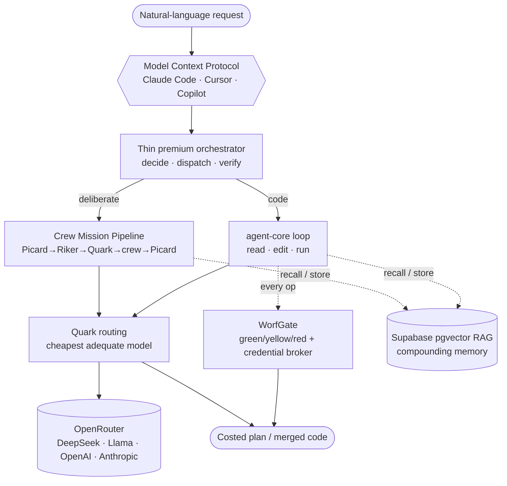
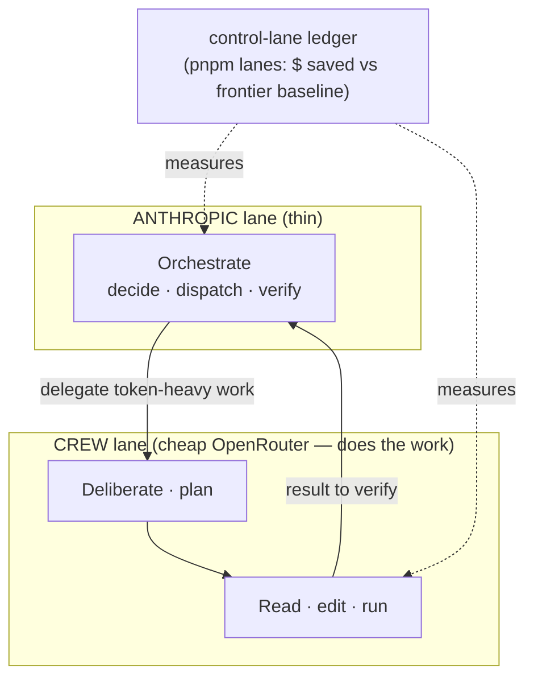
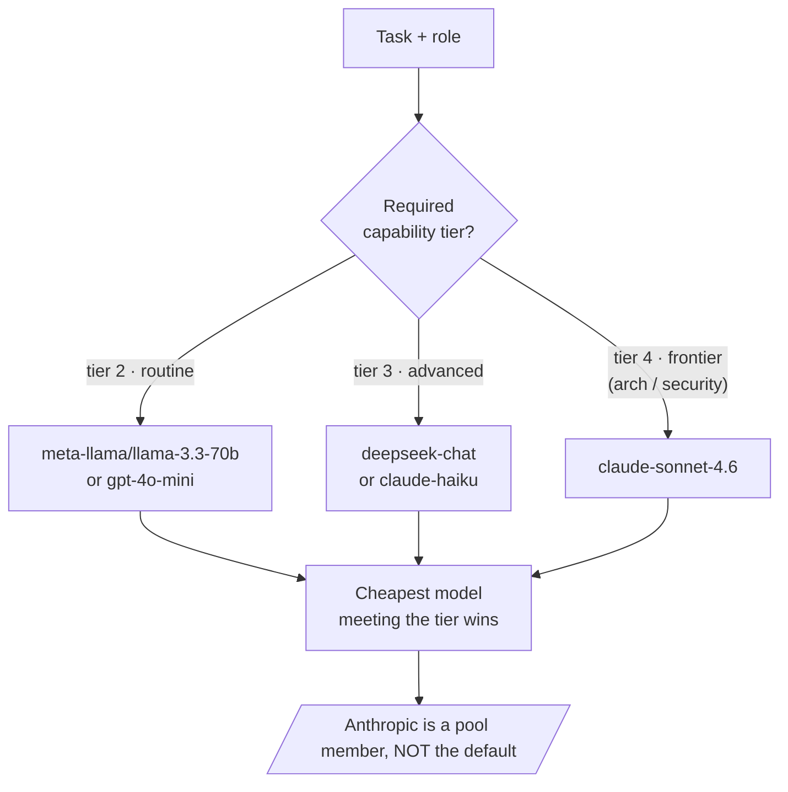
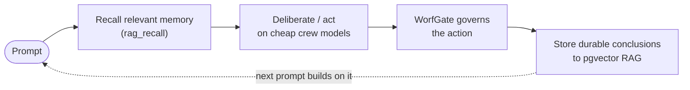

# Story Agent — Principal Engineer's Elevator Pitch

**Audience:** hiring manager / principal engineer, job-interview setting
**Format:** ~5 minutes spoken (~700 words at a normal 140 wpm)
**Goal:** explain the project step by step, the reason for each core feature, and the client benefit.

> Deliberated by the OpenRouter crew (Observation Lounge, ~$0.003) and assembled + fact-checked against the codebase. Verified facts and honest caveats are in the appendix.

> **▶ Interactive deck:** [`presentation/index.html`](./presentation/index.html) — the canonical slides these `[Slide N]` cues refer to. Real slides, **zoom/pan-able** live diagrams, this script as speaker notes (press `N`), and a 5-minute pacing timer. Open it in any browser (works offline). The `[Slide N — …]` markers below are delivery cues that map to the deck.

---

## The 5-minute spoken script

> Read at a normal pace this runs ~4.5–5 minutes. Bracketed cues point at the slide/diagram to show.

**[Slide 1 — Control flow]**

Every team using an AI coding assistant today pays the same bill: a frontier model — Claude, GPT — charges premium rates for *every* token, whether it's making an architectural decision or renaming a variable. **Story Agent is my answer to that: a self-hosted autonomous coding assistant where the expensive model does almost none of the work.**

It's built around a metaphor that turned out to be good engineering — an **eleven-member crew of specialized agents**, each with a role, a domain, and *its own* model, that deliberate, plan, and write code together. The premium model is just the orchestrator: it decides and verifies; the crew does the heavy lifting on cheap models.

The problem I'm attacking is twofold. A single frontier model is *expensive*, and it's a *black box* — you can't see why it did what it did, and it doesn't remember what it learned yesterday. I wanted something cheaper, auditable, and that compounds over time.

**[Slide 1 — trace the arrow left to right]**

Here's the flow. A natural-language request arrives over the **Model Context Protocol** — the open standard — so the same crew plugs into Claude Code, Cursor, or Copilot unchanged. The orchestrator hands it to the **crew mission pipeline**: one agent distills the goal, another assembles the right specialists, and a cost officer assigns each specialist **the cheapest model that can actually do their part**. Most work lands on DeepSeek or Llama; the frontier Anthropic model is reserved for the hardest architecture and security calls only. The specialists deliberate in the open — every position and tradeoff recorded — and produce a *costed* mission plan. For the actual coding, an agentic loop reads, edits, and runs commands on that same cheap model.

**[Slide 2 — governance + memory wrap]**

Two things wrap every action. First, a **security gate**. It brokers every credential — secrets are never logged — and it classifies every file-and-shell operation green, yellow, or red. A risky command isn't just blocked; it's **auto-remediated** — paths clamped into the workspace, a `--force` flag downgraded — so the agent keeps moving *safely* instead of stalling. Second, **memory**: before acting, the crew recalls what it learned on past missions from a vector database; afterward, it stores its conclusions. So the system gets better the more you use it.

**[Slide 3 — the money slide: cost split + routing]**

The reason for all of this is one lever: **cost, with proof.** Because the premium model only orchestrates — and I *measure* exactly when the cheap crew is driving versus the expensive one — a full eleven-member deliberation costs a fraction of a cent, on the order of two-tenths of a cent, instead of a frontier-model bill. And every one of those decisions lands on an audit trail.

For a client, that's three concrete things. **One — cost control you can see:** savings versus a frontier baseline are computed and reported, not promised. **Two — governance:** every credential access and every autonomous action is audited and policy-gated, which matters for regulated work, and clients are isolated with their own policies and their own memory. **Three — it compounds:** knowledge persists across sessions and even across *different* AI tools, because the memory is the portable brain, not the vendor.

**[Slide 1 — return to the whole]**

I'll be straight about maturity. It runs today — the crew deliberates and writes code — and I've defined a **shadow test** to decide when it's reliable enough to fully replace the premium driver; that bar isn't cleared yet. But the architecture is the point: **keep the expensive model thin, delegate to a cheap, governed, self-improving crew, and make the cost of every decision visible.** That's a pattern any team drowning in AI spend can adopt — and it's the same discipline I bring to systems generally: push work to the cheapest place that can do it correctly, and make correctness and cost observable.

*(≈ 690 words)*

---

## Supporting diagrams

### Diagram 1 — Control flow (the whole system in one picture)

### Diagram 2 — Two-lane cost model (why it's cheap)

### Diagram 3 — Quark's routing decision (cheapest adequate model)

### Diagram 4 — The compounding loop (why it gets better)

---

## Why each core feature exists (the "reason" behind the pitch)

| Feature | What it is | Why it exists (the reason) | Client benefit |
|---|---|---|---|
| **Crew mission pipeline** | 6-stage deliberation → owned, costed plan | Structured multi-perspective reasoning beats one generalist; plan is auditable | Better decisions, on the record |
| **agent-core loop** | Agentic read/edit/run on a cheap model | The heavy coding work must not run on the premium lane | Lower cost per change |
| **Quark routing** | Cheapest adequate model per task; Anthropic only tier-4 | Cost is the core lever; frontier only where it's warranted | Pay frontier prices only when it matters |
| **WorfGate** | Credential broker + green/yellow/red op governor | Autonomy needs accountability; remediate instead of hard-block | Safe automation; audit trail for regulated work |
| **RAG memory** | pgvector recall→act→store loop | A system compounds only if each turn builds on the last | Gets smarter with use; portable across tools |
| **Control-lane** | Observable crew-vs-Anthropic cost attribution | If cost is the lever, it must be measurable | Savings you can see, not just promised |
| **Client registry** | firm→client→project hierarchy, per-client policy + isolation | Multi-tenant, governed by construction | Client isolation + policy floors |
| **MCP server** | Exposes the crew's tools to any AI client | The crew brain should be portable, not locked in | No vendor lock-in |

---

## Interview framing (what the manager is really testing)

- **Judgment / tradeoffs:** the honest answer to *"why not just use Claude Code?"* — you still *use* the frontier model, but only as a thin orchestrator; the win is delegating token-heavy work to a cheap, governed, self-improving crew and **measuring** the split.
- **The one memorable line:** *"Keep the expensive model thin; make the cost of every decision visible."*
- **The one honest line (earns trust):** *"It runs today; the shadow test that says it's ready to fully replace the premium driver isn't cleared yet — and I can tell you exactly what that bar is."*

---

## Appendix — verified facts & honest caveats

**Verified (safe to state):** 11-member crew; monorepo of 4 packages (`mcp-server`, `shared`, `ui`/Next.js, `vscode-extension`); ~61k lines of TypeScript; ~150 MCP tool registrations; 41 skill-theory definitions; Model Context Protocol SDK `^1.12.0`; multi-provider `MODEL_POOL` (Meta, OpenAI, DeepSeek, Anthropic, Google); pgvector RAG (64-dim, IVFFlat cosine); WorfGate credential broker + green/yellow/red governor; control-lane cost ledger; deployed on AWS Fargate (terraform + docker). Crew deliberations measured at **~$0.002–0.0028**; an Innovation Lounge run **~$0.04**; embeddings **~$0.02 / 1M tokens**.

**Do NOT overclaim (per code recon):**
- The **shadow test** thresholds (≥90% auto-recovery, ≤~80% of frontier cost) are a *documented go-criterion*, not an achieved result — present as methodology.
- Cost figures are **per-deliberation micro-costs**, not audited monthly client savings; don't generalize "$0.04" beyond an Innovation Lounge run.
- **No verified production customers** — "Jonah"/"Bayer" are illustrative clients in docs.
- The **README still describes the older Aha story-delivery product**; the crew/OpenRouter identity lives in CLAUDE.md/AGENTS.md — be ready to explain the evolution if asked.
- Minor canon note: the crew includes **Quark (Deep Space Nine)**, not strictly TNG.
