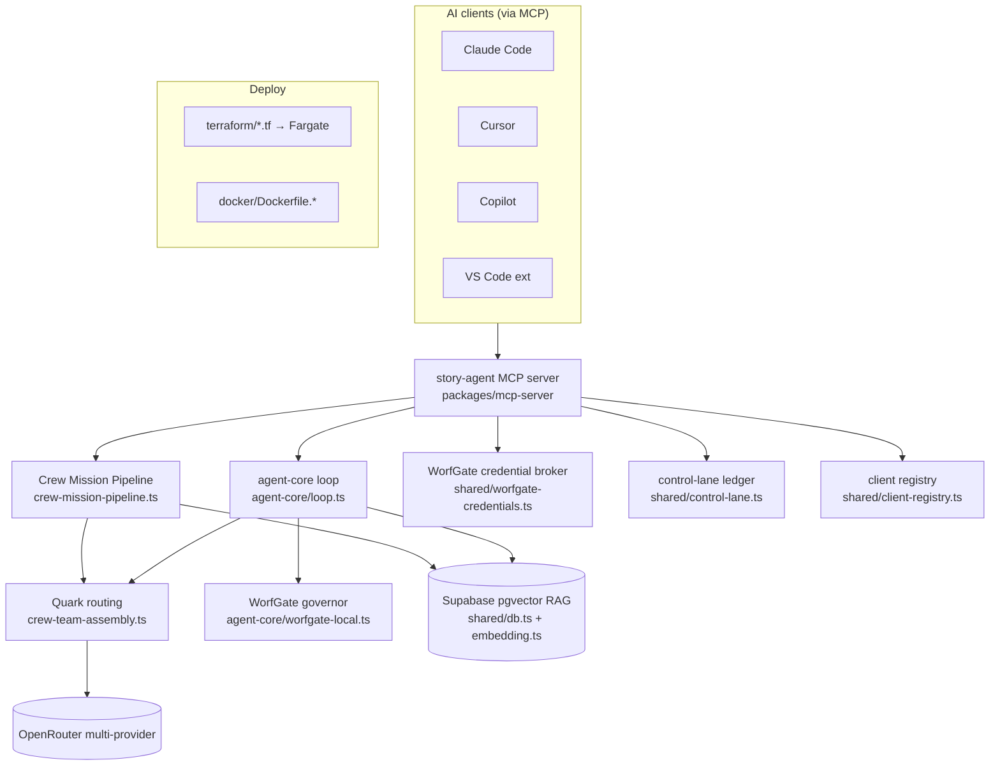
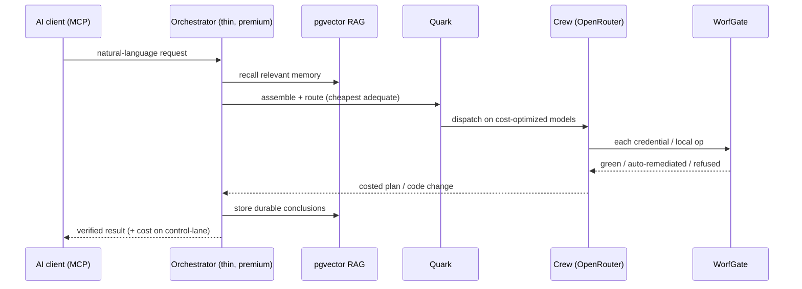

# Story Agent — System Analysis

**Purpose:** a grounded, file-cited overview of the working construct — the architecture, the core subsystems and why each exists, the request lifecycle, the current state (with honest gaps), and where it goes next. Companion to [elevator-pitch.md](./elevator-pitch.md).

> Facts below are verified against the codebase. Where a claim is a *plan* rather than an achieved result, it is flagged.

---

## 1. What it is

A **self-hosted autonomous coding assistant** — an alternative to Claude Code / Copilot / Gemini — driven by an **11-member "crew"** of specialized agents running on **OpenRouter**. The premium model (Anthropic) acts only as a thin *orchestrator*; the crew does the analysis, deliberation, and coding on cost-optimized models. *(`CLAUDE.md:3-5`)*

There are two identities in the repo: the original **Aha story-delivery pipeline** (`README.md`) and the current **OpenRouter crew assistant** (`CLAUDE.md`, `AGENTS.md`). The crew framing is primary; the story-delivery flow is a feature within it.

**Scale (verified):** pnpm monorepo, 4 packages · ~61k lines of TypeScript · ~150 `server.tool()` registrations · 41 skill theories · 11 crew agents · AWS Fargate deploy.

---

## 2. Architecture at a glance

---

## 3. Core subsystems (file-cited)

### 3.1 Crew mission pipeline / Observation Lounge
- **Where:** `packages/mcp-server/src/lib/crew-mission-pipeline.ts` → `runMissionPipeline`; MCP tool `run_crew_mission_pipeline`.
- **What:** 6-stage deliberation *(`crew-mission-pipeline.ts:4-9`)* — (1) Picard distills goals, (2) Riker assembles the crew, (3) Quark picks cheapest adequate model per member, (4) crew deliberates lounge-style, (5) Quark reports token/cost efficiency, (6) Picard synthesizes a concrete plan.
- **Why:** turns NL into an *owned, costed mission plan* on cheap models instead of burning premium tokens. Runs **frugal** by default — even Picard's bookends drop to tier-3 *(`crew-mission-pipeline.ts:19-24`)*.

### 3.2 agent-core agentic loop
- **Where:** `packages/mcp-server/src/agent-core/` (`loop.ts`, `tools.ts`, `cli.ts`, `http-server.ts`); `story-agent` CLI + `/agent` SSE endpoint.
- **What:** the tool-calling read/edit/run loop on a Quark-selected model. Supporting: `plan-then-execute.ts`, `tool-call-repair.ts`, `escalation-policy.ts`, `approval-registry.ts`, `cost-ledger.ts`, `run-registry.ts`.
- **Why:** keeps agentic coding off the premium lane.

### 3.3 Quark model routing
- **Where:** `packages/mcp-server/src/lib/crew-team-assembly.ts` — `MODEL_POOL`, `quarkSelectModel`, `crewBaseTier`, `effectiveCapabilityTier`.
- **What:** `quarkSelectModel(tier)` returns the cheapest pool model meeting the required tier. Business tier can escalate (enterprise ≥ tier-4, commercial ≤ tier-3). Pool spans Meta / OpenAI / DeepSeek / Anthropic / Google.
- **Why:** *"Anthropic is a POOL MEMBER, not the default"* *(`CLAUDE.md:27-29`)*.
- **Recent hardening (this session, commit `aa1e5fc`):** the dead `google/gemini-flash-1.5` slug (404 on chat-completions) was being picked as cheapest tier-2 and silently degrading tier-2 crew to canned demo text; it's now marked `visionOnly` and excluded from text routing (tier-2 → `llama-3.3-70b`), with a regression test.

### 3.4 WorfGate security
- **Credential broker:** `packages/shared/src/worfgate-credentials.ts` — `resolveWorfGateCredential`; chain Vault → AWS Secrets Manager → Ocelot(stub) → env; authorized by crew identity, audited, **value never logged**.
- **Local governor:** `packages/mcp-server/src/agent-core/worfgate-local.ts` — **green** (reads/search/git-status), **yellow** (bounded mutations, auto-remediated), **red** (`rm -rf`, out-of-workspace writes, secret access — refused unless remediated). Secret-path classifier blocks `.alexai-secrets`, `.ssh`, `.env`, `.zshrc` *(`worfgate-local.ts:45`)*.
- **Why:** autonomy needs accountability; remediate (clamp paths, downgrade `--force`) instead of hard-blocking.

### 3.5 RAG memory
- **Where:** schema `supabase/20260605_crew_memory_vectors.sql` (table `sa_observation_memories`, `VECTOR(64)`, IVFFlat cosine); `packages/shared/src/embedding.ts` (`embed()`, `openai/text-embedding-3-small` via the OpenRouter key, 64-dim Matryoshka).
- **What:** recall→act→store loop (`crew:get-relevant-memories` / `crew:store-memory` / `rag_recall`).
- **Why:** *"the crew compounds only if each turn builds on what it already knows"* *(`CLAUDE.md:74-90`)*.

### 3.6 Control-lane cost attribution
- **Where:** `packages/shared/src/control-lane.ts` + `delegation-hook.ts`; `agent-core/cost-ledger.ts` (`/cost` endpoint, savings vs Anthropic baseline).
- **What:** observable CREW-vs-ANTHROPIC attribution; `UserPromptSubmit` hook logs intent (Worf-safe, metrics only) to `.claude/delegation-audit.jsonl`; `pnpm lanes` prints delegated $ saved.
- **Why:** cost is the core lever — make it measurable.

### 3.7 Skill-theory framework
- **Where:** `packages/mcp-server/src/lib/skill-theories.ts` — `defineSkillTheory` (5W1H: who/what/when/where/why/how; `how.annotations` = MCP `ToolAnnotations`). **41** registered; `skill_coverage` finds gaps.
- **Why:** machine-checkable, self-describing, governed tools.

### 3.8 Dynamic client registry + Aha PM hierarchy
- **Where:** `packages/shared/src/client-registry.ts` (`onboardClient`, `resolveClientPolicy`); Supabase `clients` table with `parent_client_id`, security/business tiers, policy.
- **Model:** familiarcat (firm) → clients → projects → epics → stories → tasks (sprints = time). Aha mapping in `crew-aha-roles.ts`.
- **Why:** multi-tenant, governed, isolated by construction (RLS memory isolation: `supabase/20260607_client_memory_isolation.sql`).

### 3.9 MCP server & portability
- **Where:** `packages/mcp-server` (entry `dist/index.js`, launched by `scripts/mcp-crew-stdio.sh`); `.mcp.json` registers `story-agent` + `aha` + `figma` + `figma-context`. SDK `@modelcontextprotocol/sdk ^1.12.0`.
- **Why:** the same crew brain is reachable from any MCP client; `AGENTS.md` is the cross-tool contract.

### 3.10 Deployment
- **Where:** `terraform/` (`ecs.tf` Fargate, `alb.tf`, `route53.tf`, `redis.tf`, `cost.tf`, …); `docker/Dockerfile.mcp` + `Dockerfile.ui`. Runbooks in `docs/`.

---

## 4. Request lifecycle

---

## 5. Current state — honest assessment

**Working today:** crew deliberation (mission pipeline / Observation Lounge), agent-core coding loop, Quark routing, WorfGate broker + governor, pgvector RAG recall/store, control-lane attribution, MCP exposure, Fargate deploy artifacts. Crew deliberations measured at **~$0.002–0.0028**; Innovation Lounge **~$0.04**.

**Known gaps / not-yet-proven (do not overclaim):**
1. **Primary-driver readiness** is gated by the documented **shadow test** (Lane A ≥90% auto-recovery at parity correctness, ≤~80% frontier cost) — a *criterion*, not a passed result *(`CLAUDE.md:49-54`)*.
2. **Crew RPC/DB writes:** `sa_crew_personas` / `sa_crew_skills` writes were observed failing (RLS/permission/schema); `seedAllCrewManifests` masks it by swallowing insert errors and reporting "already initialized" *(diagnosed this session; not yet fixed)*. The lounge/stand-up work off in-code personas, so this is latent, not user-visible — but it means the DB-backed crew tables are effectively empty.
3. **Cost figures are per-deliberation micro-costs**, not audited aggregate savings.
4. **No verified production customers**; "Jonah"/"Bayer" are illustrative.
5. **README/CLAUDE.md identity drift** should be reconciled.

**Reliability fixes landed this session (commit `aa1e5fc`):** fragile lounge parser (silent officer blanks) → raw-prose fallback; dead tier-2 model slug (silent demo fallback) → excluded from text routing + regression test; new data-backed stand-up with per-officer timeout, retry, and clean exit.

---

## 6. Recommended next steps (to "solidify the construct")

1. **Fix the crew-table write path** (RLS/permission/schema) and make `seedAllCrewManifests` surface insert failures instead of masking them (Issue #2 above).
2. **Run the shadow test** and record the result, converting the go-criterion from plan → evidence.
3. **Land the async-visualization subsystem** (designed this session) so every NL prompt surfaces live async status — turning the ad-hoc `TaskOutput`/`Monitor` tracking into a platform default with heartbeats + timeout-as-terminal-state.
4. **Reconcile the README** with the crew identity.
5. **Publish a real cost-per-mission benchmark** (not just per-deliberation) to make the ROI claim audited rather than illustrative.
