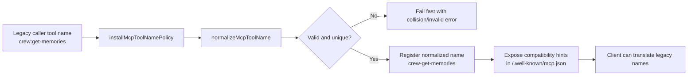
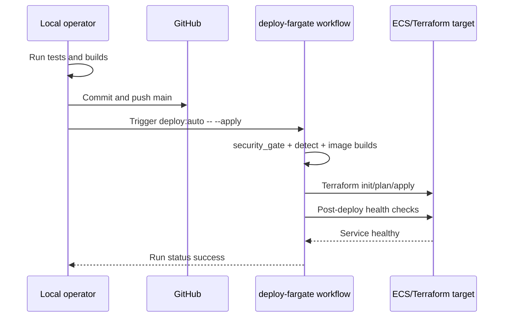

# MCP Tool Compatibility Migration and Deployment Runbook

This runbook records the crew-synthesized implementation for two startup issues and provides an operator-grade deployment path with terminal-verifiable checkpoints.

## Scope

1. Enforce MCP-safe tool names during registration.
2. Preserve client migration safety with discovery metadata.
3. Remove UI bundling warnings caused by server-only shared exports.
4. Deploy with explicit, auditable terminal steps.

## Crew cross-check synthesis

| Team | Officers | Primary responsibility | Cross-check target |
|---|---|---|---|
| Strategy | Picard, Data, Troi | Choose low-risk architecture and compatibility policy | Execution plan validity |
| Execution | Riker, Geordi, O'Brien | Implement registration normalization and server-only export boundaries | Build/runtime behavior |
| Assurance | Worf, Yar, Crusher, Quark | Validate collision safety, startup health, and deploy gates | Regression and operability |

## Architecture outcome



## Deployment sequence



## Terminal-driven deployment checklist

Run these commands in order and verify each checkpoint before continuing.

### 1) Validate code and tests

```bash
pnpm --filter @story-agent/mcp-server test -- src/lib/mcp-tool-name-policy.test.ts src/agent-core/mcp-manifest.test.ts
pnpm --filter @story-agent/shared build
pnpm --filter @story-agent/mcp-server build
pnpm --filter @story-agent/ui build
```

Checkpoint:
- Tests pass for normalization, collision safety, and manifest compatibility metadata.
- Shared, MCP server, and UI builds complete.

### 2) Verify runtime behavior locally

```bash
pnpm dev
# in another terminal
curl -sS -H 'Content-Type: application/json' -d '{"message":"ping"}' http://localhost:3103/chat
```

Checkpoint:
- Startup logs show normalized name messages from mcp-tool-name-policy.
- No critical dependency warning from UI build for iam-identity-center or worfgate-credential-providers.

### 3) Commit and push

```bash
git add -A
git commit -m "test(mcp): add compatibility coverage and runbook for tool-name migration" -m "- add normalization and collision tests\n- extend manifest compatibility tests\n- add runbook with deployment diagrams and terminal checkpoints"
git push origin main
```

Checkpoint:
- Branch is synced with origin/main.

### 4) Deploy with terminal visibility

```bash
pnpm deploy:auto -- --apply
GH_PAGER=cat PAGER=cat gh run watch --repo familiarcat/story-agent --workflow deploy-fargate --exit-status
```

Checkpoint:
- Workflow jobs succeed: security_gate, detect, build_ui, build_mcp, deploy.
- Deploy job includes Terraform apply and post-deploy health gate success.

## Rollback strategy

If normalization collisions occur in a downstream client:

1. Inspect discovery metadata in `/.well-known/mcp.json` and update client-side mapping.
2. If production calls fail, revert to the previous known-good commit and redeploy with `pnpm deploy:auto -- --apply`.
3. Re-run this runbook after fixing conflicting legacy names.

## Acceptance criteria

1. MCP startup has no invalid-character tool warnings.
2. UI build has no critical dependency warnings from server-only shared exports.
3. Manifest includes `toolNameCompatibility` guidance.
4. Deployment completes with success and post-deploy health checks passing.
